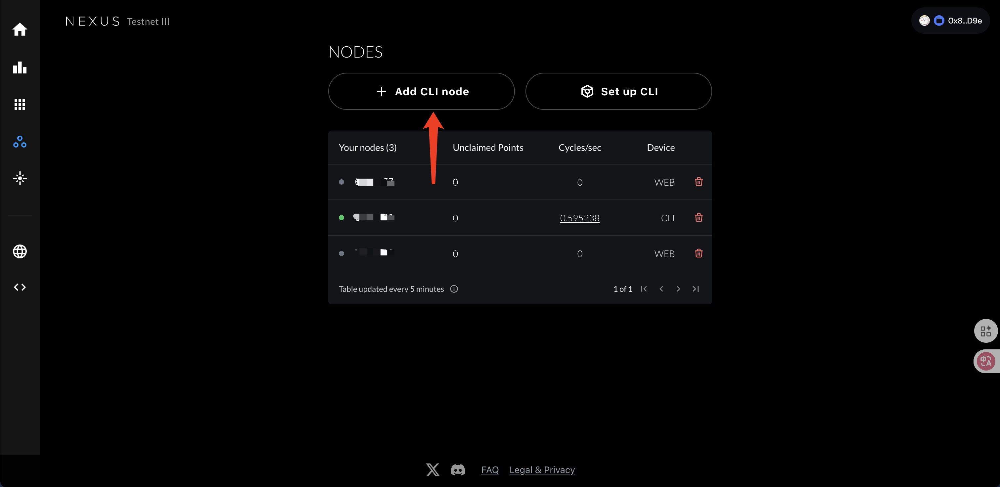

# 🖥️ **支持系统**
- 
- 

# ⚙️ **安装与运行**
## 1️⃣获取CLI Node-ID（后面执行脚本时需要输入此 ID）
访问：https://app.nexus.xyz/nodes

<div align="center">
  
</div>

## 2️⃣克隆并进入项目目录
```
git clone https://github.com/blockchain-src/Nexus_node.git && cd Nexus_node
```
---
## 2️⃣执行一键脚本
```
chmod +x nexus.sh && ./nexus.sh
```